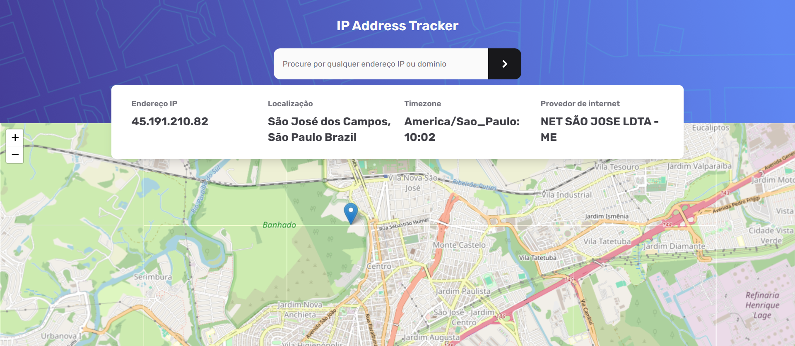

<h1 align="center">
  IP Address Tracker 📡
</h1>

<div align="center">
   <a href="https://github.com/JohnPetros">
      
   </a>
   
   <a href="https://github.com/JohnPetros/ip-address-tracker/commits/main">
      
   </a>
  </a>
   </a>
   <a href="https://github.com/JohnPetros/ip-address-tracker/blob/main/LICENSE.md">
      
   </a>
    
</div>
<br>

## 🖥️ About the project

**IP Address Tracker** is a **website** that displays user's **geolocation** information based on their public **IP address**.

The deafault IP address to be used is the current public IP address of user's network, but any valid public IP address can be provided to the application.

The goal of developing this project was to learn how to create a VPN with [openvp](https://openvpn.net/) and use it to provide some secure features like geolocation changing. Also this project is part of final work in operating system discipline at [FATEC São José dos Santos](https://fatecsjc-prd.azurewebsites.net/).

### ⏹️ Preview

<table align="center">
  <tr>
    <td align="center" width="700">
    <span>Home page<br/></span>
    
    </td>
  </tr>  
</table>

---

## ✨ Features

- [x] User network's IP address as default
- [x] App should display base on the IP address:
  - Address location
  - Timezone
  - ISP (internet service provider)
- [x] User should be able to search using a specific IP Address
- [x] App should validate the provided IP Address, showing a error message if the IP address is not valid 
- [x] App should render an interactive map that indicates User's location on the globe

---

## ⚙️ Archtecture

## 🛠️ Technologies, tools and external services

Este projeto foi desenvolvido usando as seguintes tecnologias:

✔️ **[Python](https://www.python.org/)** to program the backend

✔️ **[Flask](https://flask.palletsprojects.com/en/3.0.x/)** to make the web server

✔️ **[HTML](https://developer.mozilla.org/pt-BR/docs/Web/HTML)** to build the website home page

✔️ **[CSS](https://developer.mozilla.org/pt-BR/docs/Web/CSS)** - to style the home page

✔️ **[Leaflet](https://developer.mozilla.org/pt-BR/docs/Web/JavaScript)** - to render the interactive map

✔️ **[Sweat Alert](https://sweetalert2.github.io/)** to show alert messages on a beatiful modal

> For more details on the projects dependencies like specific versions check out the [package.json file](https://github.com/JohnPetros/ip-address-tracker/blob/main/package.json)

---

## 🚀 How to run the application

### 🔧 Prerequisitives


- [Git](https://git-scm.com/) to manipulate Git repositories
- [Python](https://www.python.org/) to install the dependencies and run the application (using [pip](https://www.w3schools.com/python/python_pip.asp))

> Also it is good to have a code editor like [VSCode](https://code.visualstudio.com/)

### 📟 Rodando a aplicação

```bash

# Clone this repository
$ git clone https://github.com/JohnPetros/ip-address-tracker.git

# Access the project folder
$ cd ip-address-tracker

# Create the virtual enviroment
$ python3 venv .venv

# Activate the virtual enviroment
$ source .venv/bin/activate # On Linux
$ source .venv\Scripts\activate # On Windows

# Install the dependencies
$ pip install -r requirements.txt

# Run the aplication
$ flask --app ./src/app/main.py:init_app run --debug -p 5005 --host 0.0.0.0

```

> Probably the application will be running on http://localhost:5005

---

## 💪 How to contribute

```bash

# Fork this repository
$ git clone https://github.com/JohnPetros/ip-address-tracker.git

# Create a branch for your feature
$ git checkout -b my-feature

# Commit your changes
$ git commit -m ' ✨feat: my feature'

# Push your branch
$ git push origin my-feature

```

> You should replace 'my-feature' wuth your feature's name that you adding

> You can also open a [new issue](https://github.com/JohnPetros/ip-address-tracker/issues) reporting some problem, question or sugestion about the project. I will really be glad to help and improve this prject as well 

---

## 📝 Licence

This application is under MIT licence. See the [licence file](LICENSE) to obtain more details about it

---

<p align="center">
  Made with 💜 by John Petros 👋🏻
</p>
